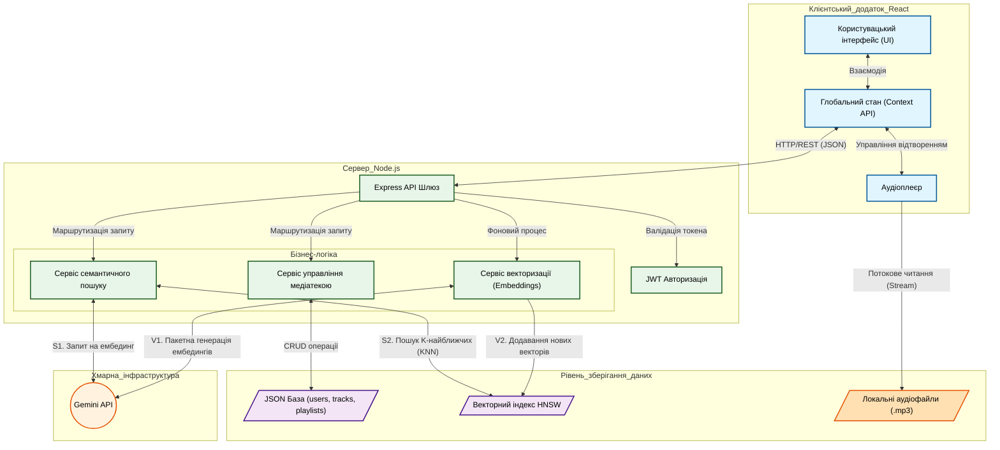
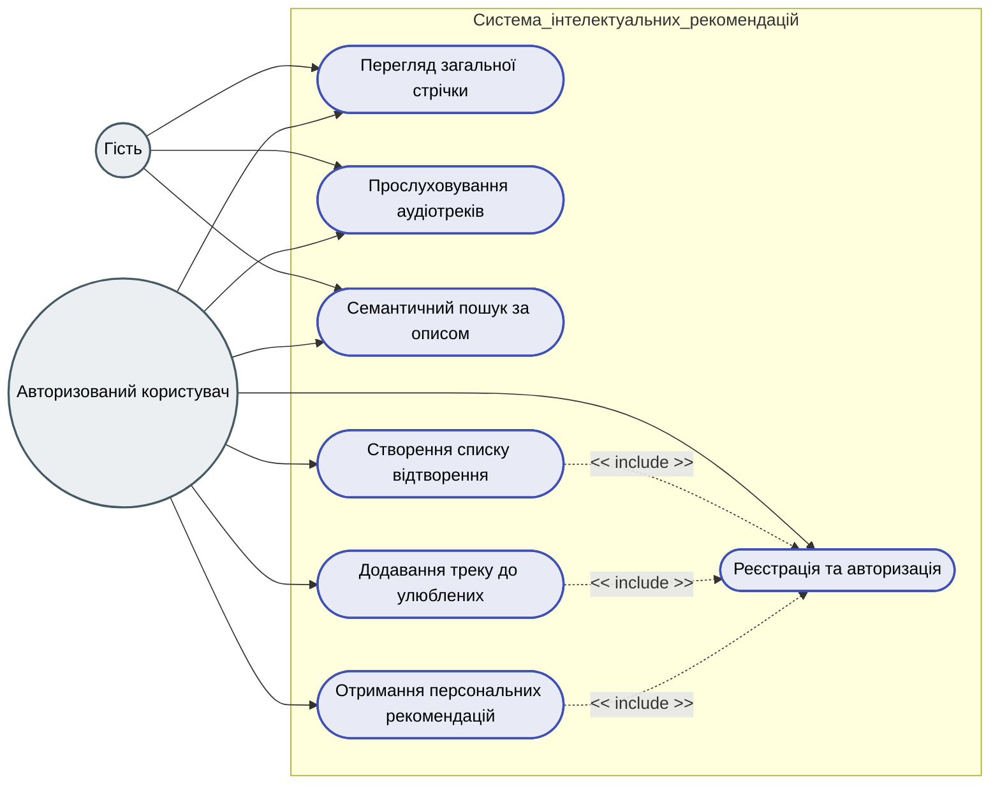
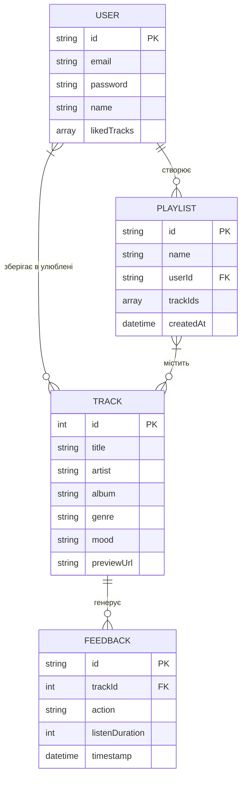
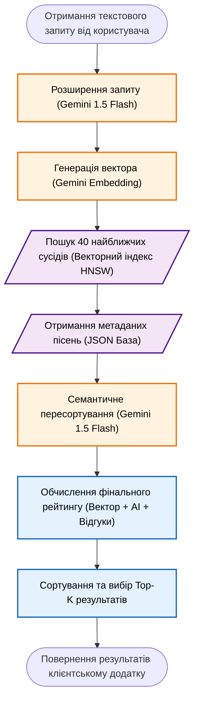

# Діаграми для Розділу 4 (Деталізована версія)

## Рисунок 4.1. Архітектурна блок-схема системи

## Рисунок 4.2. Діаграма прецедентів користувача (UML Use Case)

## Рисунок 4.3. Логічна структура бази даних (ER-діаграма)

## Рисунок 4.4. Блок-схема алгоритму семантичного пошуку

